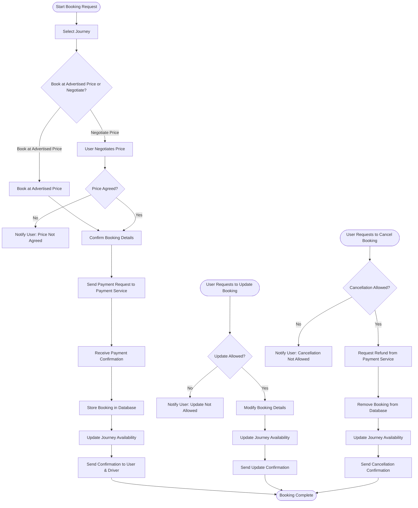

# Booking Service

The Booking Service is responsible for handling all booking-related operations. It handles the booking, alterations to and cancelling of a chosen journey.

## Overview

Core responsibilities:
 - Create booking
 - Update booking
 - Cancel booking
 - View bookings

## Service Flowchart



### Features
- **Journey Booking:** users can book seats in available journeys.
- **Booking Modification:** Users can negotiate the price with the driver prior to booking
- **Cancellation System:** Allows users to cancel their booking before the journey starts.
- **Payment Integration:** Interfaces with the Payment Service to manage transactions.
- **Notifications:** Sends booking confirmation

## Tech Stack
- Backend: Python (Flask)
- Database: SQLAlchemy
- Testing Framework: Pytest

## Prerequisites
- to be updated

## Getting Started

### Installation
```bash
# Clone the repository
git clone [repository-url]

# Navigate to service directory
cd [service-name]

# Install dependencies
npm install  # or equivalent command
```

### Configuration
1. Copy `.env.example` to `.env`
2. Update environment variables:
   - `DATABASE_URL`
   - `SERVICE_PORT`
   - `OTHER_REQUIRED_VARS`

### Running the Service
```bash
# Development mode
npm run dev  # or equivalent command

# Production mode
npm run start  # or equivalent command
```

### Testing
```bash
# Run unit tests
npm run test  # or equivalent command

# Run integration tests
npm run test:integration  # or equivalent command
```

## API Documentation

### Specification

```
info:
  title: Booking Service
  version: 0.0.0
  description: Example workspace
openapi: 3.0.0
paths:
  /bookings/{booking_id}:
    put:
      summary: Update an existing booking
      security:
        - BearerJwt: []
      tags:
        - bookings
        - update
      operationId: updateAnExistingBooking
      description: Used to update details of an existing pending or confirmed booking.
      parameters:
        - name: booking_id
          in: path
          required: true
          schema:
            type: integer
          examples:
            default:
              value: 123
          description: The unique identifier of the booking.
      requestBody:
        description: Payload required to update a booking.
        required: true
        content:
          application/json:
            schema:
              type: object
              required:
                - user_id
                - journey_id
                - status
              properties:
                user_id:
                  type: integer
                journey_id:
                  type: integer
                status:
                  type: string
                  enum:
                    - pending
                    - confirmed
                    - cancelled
            examples:
              default:
                value:
                  user_id: 12345
                  journey_id: 67890
                  status: confirmed
      responses:
        '200':
          description: Booking updated successfully.
          content:
            application/json:
              schema:
                type: object
                properties:
                  data:
                    type: object
              examples:
                default:
                  value:
                    data:
                      booking_id: 123
                      user_id: 12345
                      journey_id: 67890
                      status: confirmed
        '400':
          description: The request was invalid or improperly formatted.
          content:
            application/json:
              schema:
                type: object
                properties:
                  message:
                    type: string
              examples:
                default:
                  value:
                    message: Invalid request. Please check your input data.
        '401':
          description: Authentication is required to access the requested resource.
          content:
            application/json:
              schema:
                type: object
                properties:
                  message:
                    type: string
              examples:
                default:
                  value:
                    message: Unauthorized. Please provide a valid token.
        '403':
          description: Access is denied. User does not have permission for this action.
          content:
            application/json:
              schema:
                type: object
                properties:
                  message:
                    type: string
              examples:
                default:
                  value:
                    message: >-
                      Forbidden. You do not have permission to modify this
                      booking.
        '404':
          description: The requested resource was not found.
          content:
            application/json:
              schema:
                type: object
                properties:
                  message:
                    type: string
              examples:
                default:
                  value:
                    message: Booking not found.
        '409':
          description: >-
            The request could not be completed due to a conflict with the
            current state of the resource.
          content:
            application/json:
              schema:
                type: object
                properties:
                  message:
                    type: string
              examples:
                default:
                  value:
                    message: >-
                      Booking conflict. No available seats or duplicate booking
                      request.
        '500':
          description: The server encountered an unexpected error.
          content:
            application/json:
              schema:
                type: object
                properties:
                  message:
                    type: string
              examples:
                default:
                  value:
                    message: An internal server error occurred.
    delete:
      summary: Cancel a booking
      security:
        - BearerJwt: []
      tags:
        - bookings
        - delete
      operationId: cancelABooking
      description: Used to cancel a pending or confirmed booking.
      parameters:
        - name: booking_id
          in: path
          required: true
          schema:
            type: integer
          examples:
            default:
              value: 123
          description: The unique identifier of the booking.
      responses:
        '204':
          description: Booking successfully cancelled.
        '400':
          description: The request was invalid or improperly formatted.
          content:
            application/json:
              schema:
                type: object
                properties:
                  message:
                    type: string
              examples:
                default:
                  value:
                    message: Invalid request. Please check your input data.
        '401':
          description: Authentication is required to access the requested resource.
          content:
            application/json:
              schema:
                type: object
                properties:
                  message:
                    type: string
              examples:
                default:
                  value:
                    message: Unauthorized. Please provide a valid token.
        '403':
          description: Access is denied. User does not have permission for this action.
          content:
            application/json:
              schema:
                type: object
                properties:
                  message:
                    type: string
              examples:
                default:
                  value:
                    message: >-
                      Forbidden. You do not have permission to modify this
                      booking.
        '404':
          description: The requested resource was not found.
          content:
            application/json:
              schema:
                type: object
                properties:
                  message:
                    type: string
              examples:
                default:
                  value:
                    message: Booking not found.
        '500':
          description: The server encountered an unexpected error.
          content:
            application/json:
              schema:
                type: object
                properties:
                  message:
                    type: string
              examples:
                default:
                  value:
                    message: An internal server error occurred.
  /bookings:
    get:
      summary: Retrieve a list of bookings
      security:
        - BearerJwt: []
      tags:
        - bookings
        - view
      operationId: viewBookings
      description: Used to retrieve a list of bookings.
      responses:
        '200':
          description: A list of bookings.
          content:
            application/json:
              schema:
                type: object
                properties:
                  data:
                    type: array
                    items:
                      type: object
                      properties:
                        booking_id:
                          type: integer
                        user_id:
                          type: integer
                        journey_id:
                          type: integer
                        status:
                          type: string
                          enum:
                            - pending
                            - confirmed
                            - cancelled
              examples:
                default:
                  value:
                    data:
                      - booking_id: 123
                        user_id: 12345
                        journey_id: 67890
                        status: pending
                      - booking_id: 124
                        user_id: 12346
                        journey_id: 67891
                        status: confirmed
        '401':
          $ref: '#/components/responses/Unauthorized'
        '403':
          $ref: '#/components/responses/Forbidden'
        '500':
          $ref: '#/components/responses/InternalServerError'
    post:
      summary: Create a new booking
      security:
        - BearerJwt: []
      tags:
        - bookings
        - create
      operationId: createANewBooking
      description: Used to create a new booking.
      requestBody:
        description: Payload required to create a new booking.
        required: true
        content:
          application/json:
            schema:
              type: object
              required:
                - user_id
                - journey_id
                - status
              properties:
                user_id:
                  type: integer
                journey_id:
                  type: integer
                status:
                  type: string
                  enum:
                    - pending
                    - confirmed
                    - cancelled
            examples:
              default:
                value:
                  user_id: 12345
                  journey_id: 67890
                  status: pending
      responses:
        '201':
          description: Booking created successfully.
          content:
            application/json:
              schema:
                type: object
                properties:
                  data:
                    type: object
              examples:
                default:
                  value:
                    data:
                      booking_id: 123
                      user_id: 12345
                      journey_id: 67890
                      status: pending
        '400':
          description: The request was invalid or improperly formatted.
          content:
            application/json:
              schema:
                type: object
                properties:
                  message:
                    type: string
              examples:
                default:
                  value:
                    message: Invalid request. Please check your input data.
        '401':
          description: Authentication is required to access the requested resource.
          content:
            application/json:
              schema:
                type: object
                properties:
                  message:
                    type: string
              examples:
                default:
                  value:
                    message: Unauthorized. Please provide a valid token.
        '403':
          description: Access is denied. User does not have permission for this action.
          content:
            application/json:
              schema:
                type: object
                properties:
                  message:
                    type: string
              examples:
                default:
                  value:
                    message: >-
                      Forbidden. You do not have permission to modify this
                      booking.
        '409':
          description: >-
            The request could not be completed due to a conflict with the
            current state of the resource.
          content:
            application/json:
              schema:
                type: object
                properties:
                  message:
                    type: string
              examples:
                default:
                  value:
                    message: >-
                      Booking conflict. No available seats or duplicate booking
                      request.
        '500':
          description: The server encountered an unexpected error.
          content:
            application/json:
              schema:
                type: object
                properties:
                  message:
                    type: string
              examples:
                default:
                  value:
                    message: An internal server error occurred.
components:
  responses:
    Conflict:
      description: >-
        The request could not be completed due to a conflict with the current
        state of the resource.
      content:
        application/json:
          schema:
            type: object
            properties:
              message:
                type: string
          examples:
            default:
              value:
                message: >-
                  Booking conflict. No available seats or duplicate booking
                  request.
    NotFound:
      description: The requested resource was not found.
      content:
        application/json:
          schema:
            type: object
            properties:
              message:
                type: string
          examples:
            default:
              value:
                message: Booking not found.
    BadRequest:
      description: The request was invalid or improperly formatted.
      content:
        application/json:
          schema:
            type: object
            properties:
              message:
                type: string
          examples:
            default:
              value:
                message: Invalid request. Please check your input data.
    Unauthorized:
      description: Authentication is required to access the requested resource.
      content:
        application/json:
          schema:
            type: object
            properties:
              message:
                type: string
          examples:
            default:
              value:
                message: Unauthorized. Please provide a valid token.
    Forbidden:
      description: Access is denied. User does not have permission for this action.
      content:
        application/json:
          schema:
            type: object
            properties:
              message:
                type: string
          examples:
            default:
              value:
                message: Forbidden. You do not have permission to modify this booking.
    InternalServerError:
      description: The server encountered an unexpected error.
      content:
        application/json:
          schema:
            type: object
            properties:
              message:
                type: string
          examples:
            default:
              value:
                message: An internal server error occurred.
  parameters:
    booking_id:
      name: booking_id
      in: path
      required: true
      schema:
        type: integer
      examples:
        default:
          value: 123
      description: The unique identifier of the booking.
  securitySchemes:
    BearerJwt:
      type: http
      scheme: bearer
      bearerFormat: JWT
      description: >-
        Authenticated requests must include a valid JWT token in the
        `Authorization: Bearer <JWT>` header.
tags:
  - name: bookings
    description: Endpoints related to booking operations.
  - name: update
    description: Endpoints for updating resources.
  - name: delete
    description: Endpoints for deleting resources.
  - name: create
    description: Endpoints for creating resources.
  - name: view
    description: Endpoints for viewing resources.
```

### Endpoints
- `GET /bookings` - Retrieve a list of bookings.
- `POST /bookings` - Create a new booking.
- `PUT /bookings/{booking_id}` - Update an existing booking.
- `DELETE /bookings/{booking_id}` - Cancel a booking.


## Monitoring and Logging
- Metrics collection
- Log locations
- Monitoring tools used

## Deployment
- Deployment process
- Required environment variables
- Infrastructure dependencies


## Contact
- User responsible: [Leeds Username]
