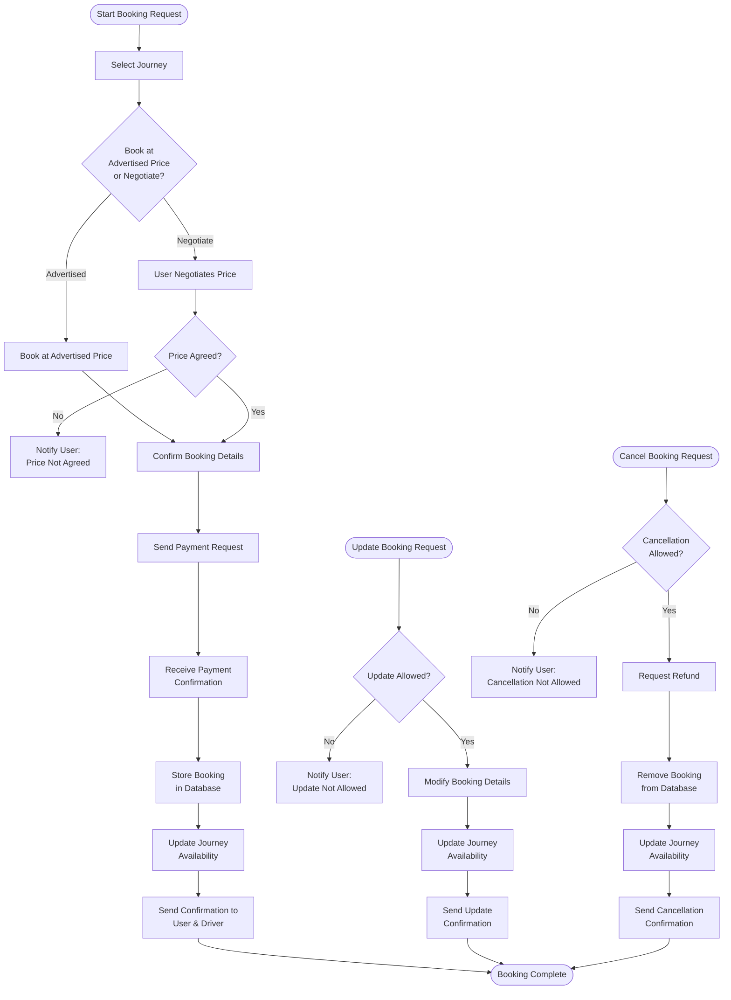

# Booking Service

The Booking Service is responsible for handling all booking-related operations. It handles the booking, alterations to and cancelling of a chosen journey.

## Overview

Core responsibilities:
 - Create booking
 - Update booking
 - Communicate with payment service

## Service Flowchart



### Features
- **Journey Booking:** users can book seats in available journeys.
- **Booking Modification:** Users can negotiate the price with the driver prior to booking
- **Cancellation System:** Allows users to cancel their booking before the journey starts.
- **Payment Integration:** Interfaces with the Payment Service to manage transactions.
- **Notifications:** Sends booking confirmation

## Tech Stack
- Backend: Python (Flask)
- Database: PostgreSQL
- Testing Framework: Pytest

## Prerequisites
- to be updated

## Getting Started

### Installation
```bash
# Clone the repository
git clone [repository-url]

# Navigate to service directory
cd [service-name]

# Install dependencies
npm install  # or equivalent command
```

### Configuration
1. Copy `.env.example` to `.env`
2. Update environment variables:
   - `DATABASE_URL`
   - `SERVICE_PORT`
   - `OTHER_REQUIRED_VARS`

### Running the Service
```bash
# Development mode
npm run dev  # or equivalent command

# Production mode
npm run start  # or equivalent command
```

### Testing
```bash
# Run unit tests
npm run test  # or equivalent command

# Run integration tests
npm run test:integration  # or equivalent command
```

## API Documentation

### Endpoints
- `GET /api/v1/resource` - Description
- `POST /api/v1/resource` - Description
- `PUT /api/v1/resource/:id` - Description
- `DELETE /api/v1/resource/:id` - Description

## Monitoring and Logging
- Metrics collection
- Log locations
- Monitoring tools used

## Deployment
- Deployment process
- Required environment variables
- Infrastructure dependencies


## Contact
- User responsible: [Leeds Username]
