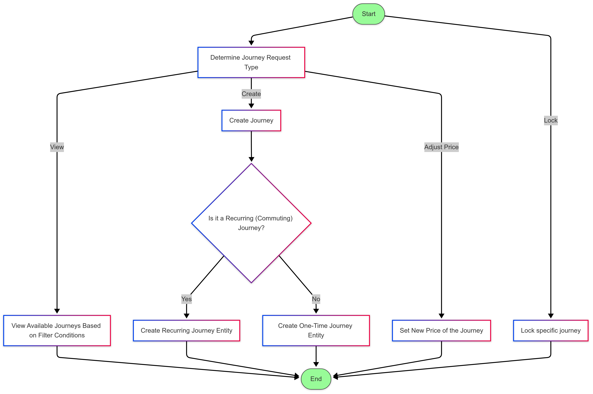

# Journey Service

The Journey Service is responsible for handling all
journey-related operations. It handles the creation, viewing, adjustment and locking of journeys.

## Overview

This service handles many core responsibilities for managing journey functionalities. It's core functionality is as follows:
 - Create one-way and commuter journeys
 - View journeys based on filtering conditions
 - Lock journeys while they are in the pending state
 - Price adjustment of a previously created journey

### Features
 - Endpoints that provide functionality for the journey service
 - Created journeys are stored persistantly in the database 

## Service Flowchart


## Tech Stack
- Backend: Python
- Database: MSSQL
- Testing Framework: Pytest
- ORM: SQLAlchemy, Pydantic for configuration

## Prerequisites
 - Required software/tools (Python and Docker)
 - Environment dependencies (Python packages listed in requirements.txt)
 - External service dependencies (MSSQL for production) 

## Getting Started

### Installation
```bash
# Clone the repository
git clone [repository-url]

# Navigate to service directory
cd Pendo.JourneyService

# Install dependencies
pip install -r requirements.txt
```

### Configuration
1. Copy configuration 

### Running the Service
```bash
# Build the database container (Pendo.Database)
./runDatabase.sh

#Then publish the database

# Build and run the Pendo.JourneyService container (tests also run)

./runJourneyService.sh
```

### Testing
```bash

# Build and run the Pendo.JourneyService container (tests also run)

./runJourneyService.sh
```

## Monitoring and Logging
The service logs critical events and metrics. Container logs can be accessed through

```bash
docker logs Pendo.JourneyService
```

## Deployment
Deploy the service using Docker with the provided Dockerfile and shell scripts:
- `./runDatabase.sh` for the database.
- `./runJourneyService.sh` for the application.


## Contact
- User responsible: Catherine Weightman @sc23c2w