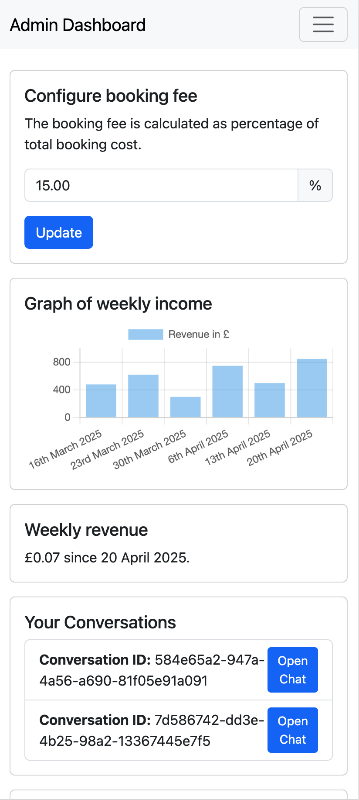
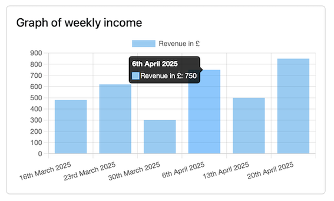
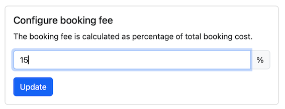
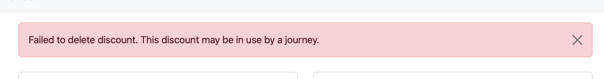
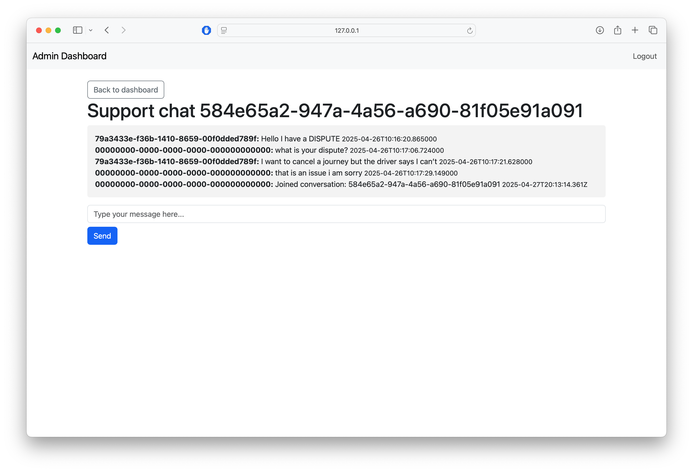

# ADMIN & MANAGEMENT FEATURES

The Admin Dashboard offers management staff tools to observe revenue information, configure business logic, and respond to support requests from users.

The website is available at [https://pendo-manager.clsolutions.dev/dashboard](https://pendo-manager.clsolutions.dev/dashboard). It works on desktop or mobile.

| Desktop Screenshot | Mobile Screenshot |
|:------------------:|:------------------:|
|  |  |

## Login

Specific emails associated with company management have been reserved manager status. You are only permitted to use the Admin Dashboard if your account holds such status. Unauthorised users will not be able to log in.

Enter your email, then check your inbox for an OTP. Make sure to check spam if you can't see it.

## Weekly Revenue and Graph of Weekly Income

The Weekly Revenue section displays the total revenue earned within the last 7 days from the date observed.

The weekly income graph shows the profits made over the last six weeks. The horizontal axis shows the lower bound from which the bar records revenue from, while the vertical axis shows revenue from the week.

You can hover your mouse cursor over the bars to view a specific value for each week.

## Configuring Booking Fees and Discounts

### Configure the booking fee

This feature allows managers to specify an app-wide booking fee. To set the fee:

- Enter the desired percentage.
- Click the Update button to save your changes.
- Once changed, this new booking fee will apply to all new bookings that are made.

### Configure discounts

This feature enables managers to create and manage discount offers for users.  
To create a new discount:

- Select the 'Create New Discount' button and input the discount details.
- Once established, discounts can be seen in this area, so managers are able to modify or delete them as required.

**Note:** You may not be able to delete an existing discount. This means that it is in use by a current journey, and the journey must be completed or cancelled before the discount can be removed.

## Messaging

The messaging area allows managers to communicate with users who require support. When a user initiates a support request, it will appear in this section. Managers can click on a conversation to review the message and respond directly from the dashboard, allowing for efficient communication between users and managers.

