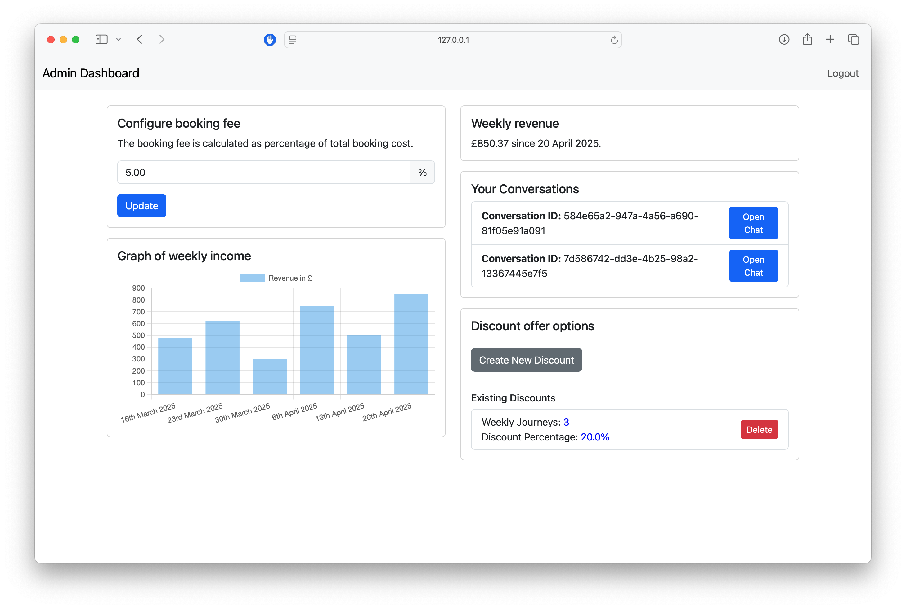
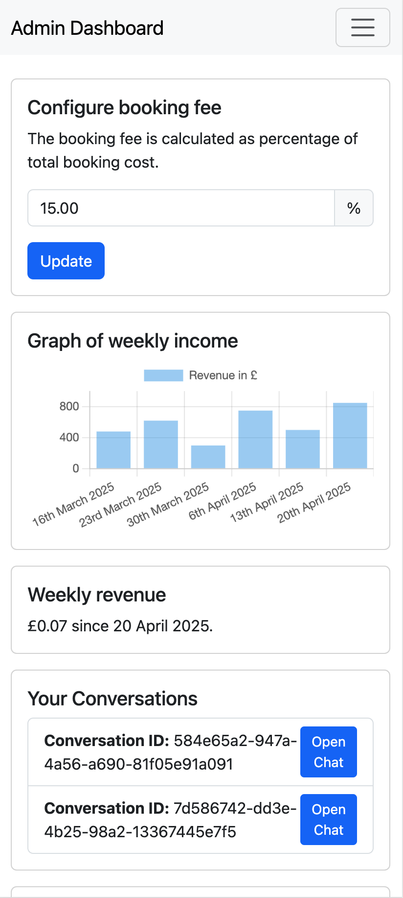
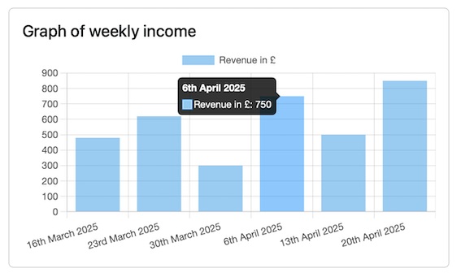
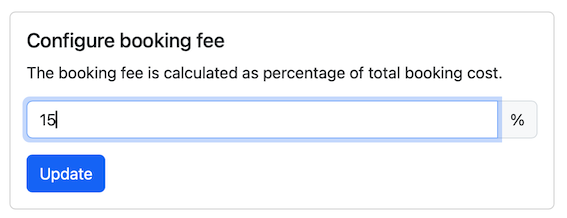
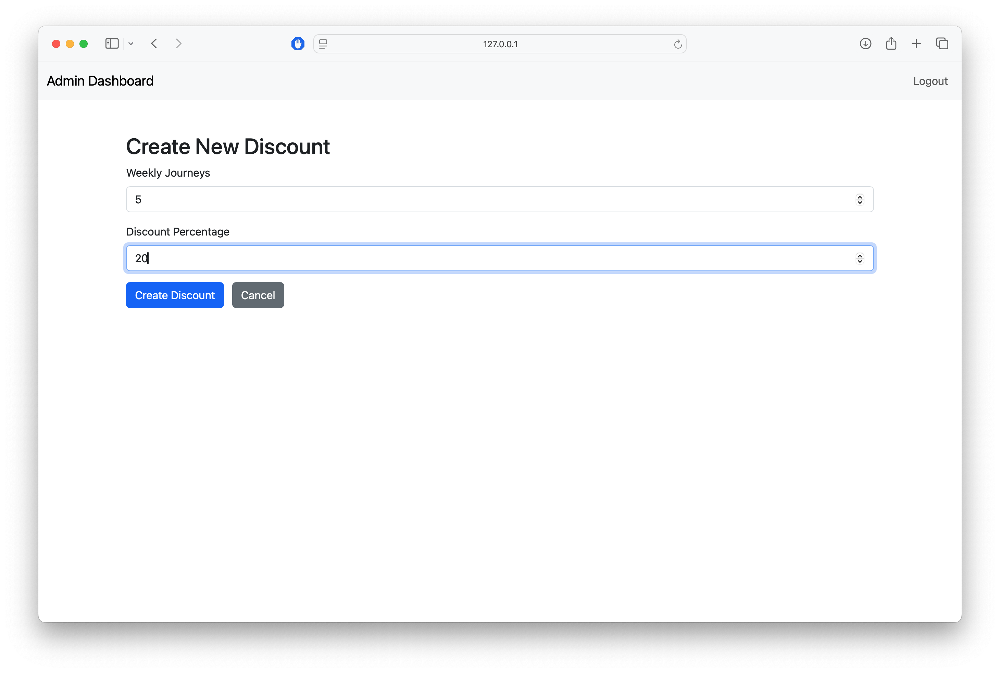
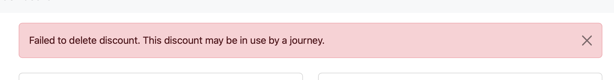
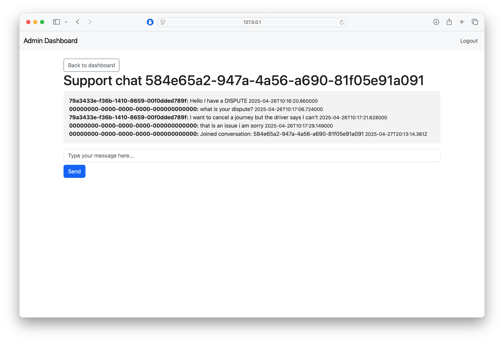

# User Guide

## Table of Contents

   * [Table of Contents](#table-of-contents)
   * [Introduction](#introduction)
      * [Key features of the platform](#key-features-of-the-platform)
        + [User Features](#user-features)
        + [Management Features](#management-features)
   * [Client App (Pendolare)](#client-app-pendolare)
      + [Account Creation](#account-creation)
      + [Logging in and out](#logging-in-and-out)
      + [Searching for a Journey](#searching-for-a-journey)
      + [Searching and filtering Regular Journeys](#searching-and-filtering-regular-journeys)
      + [Viewing the Regular Journey Details](#viewing-the-regular-journey-details)
      + [Searching and Filtering Commuter Journeys](#searching-and-filtering-commuter-journeys)
      + [Viewing Commuter Journey Details](#viewing-commuter-journey-details)
      + [Booking a Journey](#booking-a-journey)
      + [Payment process ](#payment-process)
      + [Modifying or cancelling a booking](#modifying-or-cancelling-a-booking)
      + [Modifying a booking](#modifying-a-booking)
      + [Cancelling a booking ](#cancelling-a-booking)
      + [Hosting a Journey (For Drivers)](#hosting-a-journey-for-drivers)
      + [Setting a commuter journey ](#setting-a-commuter-journey)
      + [Messaging & Notifications](#messaging--notifications)
      + [Communicating with other Drivers](#communicating-with-other-drivers)
      + [Contacting Management](#contacting-management)
   * [Admin Dashboard](#admin-dashboard)
      + [Login](#login)
      + [Weekly Revenue and Graph of Weekly Income](#weekly-revenue-and-graph-of-weekly-income)
   * [Configuring Booking Fees and Discounts](#configuring-booking-fees-and-discounts)
      + [Configure the booking fee](#configure-the-booking-fee)
      + [Configure discounts](#configure-discounts)
      + [Messaging](#messaging)

<!-- TOC end -->

## Introduction
  
Pendolare is a journey sharing platform built using a microservice architecture combined with a web app and mobile app. The application enables users to create, book and manage journeys whilst enabling a real-time messaging service between passengers and drivers. It features a secure authentication system for signing up and logging in, payment integration, and a booking system.

### Key features of the platform
 
#### User Features

Users can:
•	Create and manage their accounts
•	Search for available car-share journeys based on location, date and other specifications
•	Book available journeys, negotiate times, pick-up locations and costs with the driver
•	Make payments for booked journeys 
•	Rate the driver after the journey has been completed
•	View past, cancelled and upcoming journeys
 
#### Management Features

Managers can:
•	View journey details
•	Track weekly and overall income from bookings
•	Modify the booking fee
•	Create, view and delete discounts for users
•	Provide customer support for users facing issues with their bookings using the in-app messaging service

## Client App (Pendolare)

The Client App is the main user interface for Pendolare.
> Instructions on how to run the application can be found [**here**](Pendo.ClientApp).

### Account Creation

This section describes how to create a new account within the Pendolare App.

1.	Start the Expo server (see startup guide linked above).

2.	When you open the app, you will be automatically directed to the account login and signup screen.

3.	To create your account, enter a valid email address on the signup/login screen. After you enter your email address, the system will generate and send a One-Time Password (OTP) to the entered email address for verification. 

4.	Navigate to your email inbox and locate the email with the OTP. Carefully input the OTP you got via email into the OTP section on the app.

Your user account will be created if you successfully enter and validate the OTP. You will get a confirmation message within the app stating that your account was successfully created.
Subsequent Logins

1.	Launch the app on your phone and enter the same email address that was used to create the account initially on the signup/login page. The system will produce and send a new OTP to your registered email address.
2.	Locate the OTP in your email inbox and enter it into the app to log in to your account.
Note: The Pendolare app uses a One-Time Password system for further security during each login. While a new OTP is required for every login attempt, the account creation process only must be completed once.

  

### Logging in and out

1.	Navigate to your Settings by tapping the rightmost button on the bottom navigation bar.
2.	In the top right corner, tap the blue Account Settings icon.
3.	From the options presented, select the Sign Out button
4.	You will be logged out and returned to the login/signup screen.
 
### Searching for a Journey

This section details how to search for and view information about available journeys within the app.
1.	Click the search icon located on the bottom navigation bar. This will take you to the journey search page.
2.	There are two different journey types available under the ‘Book a Journey’ heading. 
a.	‘Search regular journeys’ – Use this to find a one-time journey 
b.	‘Search commuter journeys’ – Use this to locate recurring journeys

  

### Searching and filtering Regular Journeys

When you click "Search Regular Journeys," a list of all currently available journeys will appear. To narrow your search, you can use filters based on the following criteria:
•	Pickup Location
•	Search Radius
•	Drop-off Location
•	Journey Time
After applying your selected filters, the list of journeys will be updated to only include those that meet your requirements.

  

### Viewing the Regular Journey Details

When you find a journey that interests you, tap on it to view more information such as:
•	Driver Name
•	Driver Rating
•	Price
•	Pickup Location
•	Dropoff Location
•	Departure Date and Time
•	Available Seats

### Searching and Filtering Commuter Journeys

The filtering options for commuter trips are identical to those for regular trips (pickup location, search radius, drop-off location, and journey time).
The list of available commuter journeys will show which days of the week the driver usually offers this recurring journey.

### Viewing Commuter Journey Details
Tap on a commuter journey from the list to get more information about a recurring journey you want to book.
You will receive information on:
•	The date and times of the individual journeys
•	The cost of the individual journeys
•	A price breakdown at the bottom, which includes the overall cost of the commuter journeys and possibly a frequent rider discount that has been automatically applied based on the number of journeys you are booking
Using this, you can quickly identify the journeys that best fit your preferences and retrieve all the information you need before making a booking.

  

 
### Booking a Journey
 This section explains the process of booking a selected journey through the Pendolare app.
1.	Once you have chosen a journey and checked the details, book it by tapping the ‘booking’ button at the bottom of the journey details page. 

2.	You will need to check that your non-pending account balance is sufficient to complete the transaction. Before your booking is completed, the app will validate your balance.        
                                             
3.	After your booking has been completed, you will receive an immediate in-app message confirming that your journey has been booked. In addition to the in-app notification, a confirmation email with booking information will be sent to the email address linked to your account. Check your inbox for this confirmation.

The booking journey will now display in the app’s 'Upcoming Journeys’ area. Here, you can:

•	View information about your booking, including the date, time, pickup and drop-off locations and driver information.
•	Start communicating with the driver of your scheduled journey
•	Cancel your booking, although this depends on the cancellation policy 

### Payment process 

This section outlines how to manage your in-app balance and payment methods.
Navigate to your Account Settings in the app, which displays two types of balances:
Pending Balance 
This reflects the expected payout for journeys you have accepted as a driver but have not yet completed. The amount shown is the journey price minus the app’s admin fee.
Non-Pending Balance 
This is the balance available for making your bookings.

1.	There are two methods to increase your Non-Pending Balance. The first is by offering and providing journeys as a driver, your earnings (after the admin fee) will be credited to your non-pending balance. The second method is by using the ‘Top Up Balance’ button, found underneath your balances, to add funds via card payment. You can choose how much you want to add and have the option to add a new card by entering your details. 

2.	To access and manage your previously stored payment methods, tap the ‘Payment Method’ button below the ‘Top up Balance’ button.

3.	If you have a non-pending balance, press the "Request Payout" button to transfer the money to your bank account.

### Modifying or cancelling a booking
 This section explains how to modify or cancel an existing booking

### Modifying a booking

1.	Navigate to the Upcoming Bookings area of the app. Tap on the journey you wish to modify or cancel to view its details.
2.	To begin a modify request via the messaging interface, search for a plus sign (+) on the lefthand side of the messaging service.
3.	Tap the + symbol and choose the part of the booking you want to change (for example, pickup location or time). The driver will get a message with your change request.
4.	You may then communicate directly with the driver using the in-app messaging service to discuss and agree on the proposed changes to the journey.

  

### Cancelling a booking 

1.	Navigate to the Upcoming Bookings area of the app. Tap on the journey you wish to cancel to view its details.
2.	To begin a modify request via the messaging interface, search for a plus sign (+) on the lefthand side of the messaging service.
3.	Tap the + symbol and select 'Request Cancellation'.
4.	The request will then display in chat and an email will be sent signalling cancellation.

#### Cancellation Policy:
1.	Cancellation is free of charge for the user if the user cancels 15 minutes or more before the scheduled journey time.
2.	The user will be charged 75% of the agreed-upon journey fee if the user cancels less than 15 minutes till the scheduled journey time.
Once you confirm the cancellation of your booked journey, the journey will be removed from your Upcoming Journeys and added to the Cancelled Journeys area of the app.

### Hosting a Journey (For Drivers)
 
Creating and managing journeys
This section guides drivers on how to create and manage their advertised journeys on the platform.
To create a ride, go to the "Journey" section of the app. Then, tap the "Create a Ride" button under the "Advertise your journey" section. You will need to enter these details to create your advert:
•	Pick-up and drop-off locations 
•	Cost per seat
•	Number of available seats
•	Vehicle registration plate
•	The date and time of your journey
•	Your vehicle’s boot size (height and width) – although this is optional 

### Setting a commuter journey 

If you are offering a recurring journey, tap the Commuter Journey button.
You will be given the following options:
•	Select the frequency with which the travel will occur (weekly, fortnightly, or monthly).
•	Choose the date and time that the repeating journey will begin.
•	Choose the date and time on which the repeating journey will end.
•	Choose the days of the week when the journey will be offered.
•	Apply discounts if there are any available discounts for your route
After entering all the journey details for either a single or commuter journey, you will be shown an overview of the journey details. If you're happy with the information, tap the ‘Create Ride’ button at the bottom of the screen.
After the journey has been successfully created, it will be added to the list of available Journeys and made visible to other users. If there was an issue creating the journeys you will receive an error message.
To see and manage your advertised travels, go to the My Listings page. This page contains the tabs for:
•	Displaying the journeys that users have successfully booked through your listing
•	Displaying the journeys that you are currently advertising
•	Displaying your previous journeys
  
### Messaging & Notifications
This section explains how to use the messaging features within the application to communicate with drivers and platform management
 
To access messaging, tap the Messaging icon located on the bottom navigation bar. This will take you to your conversations. Here, you can view a list of your past conversations.

  

### Communicating with other Drivers
After booking a journey, a new conversation with the driver can be created. You can use the in-app messaging service to propose modifications to the journey details, such as pickup location or time, and reach an agreement.

### Contacting Management
To contact Pendolare management for support or inquiries, tap the Contact Support button on the in-app messaging screen.
 You will be asked to pick a category for your request to ensure that it is sent to the correct team.  The possible categories include:
•	Billing and Payments 
•	Accounts and Authentication
•	Disputes and issues.
•	General Enquiries
When you pick a category, your request will be sent to the management team, who will be able to assist you.

## Admin Dashboard

The Admin Dashboard offers management staff tools to observe revenue information, configure business logic, and respond to support requests from users.

The website is available at [https://pendo-manager.clsolutions.dev/dashboard](https://pendo-manager.clsolutions.dev/dashboard). It works on desktop or mobile.

| Desktop Screenshot | Mobile Screenshot |
|:------------------:|:------------------:|
|  |  |

### Login

Specific emails associated with company management have been reserved manager status. You are only permitted to use the Admin Dashboard if your account holds such status. Unauthorised users will not be able to log in.

Enter your email, then check your inbox for an OTP. Make sure to check spam if you can't see it.

### Weekly Revenue and Graph of Weekly Income

The Weekly Revenue section displays the total revenue earned within the last 7 days from the date observed.

The weekly income graph shows the profits made over the last six weeks. The horizontal axis shows the lower bound from which the bar records revenue from, while the vertical axis shows revenue from the week.

You can hover your mouse cursor over the bars to view a specific value for each week.

## Configuring Booking Fees and Discounts

### Configure the booking fee

This feature allows managers to specify an app-wide booking fee. To set the fee:

- Enter the desired percentage.
- Click the Update button to save your changes.
- Once changed, this new booking fee will apply to all new bookings that are made.

### Configure discounts

This feature enables managers to create and manage discount offers for users.  
To create a new discount:

- Select the 'Create New Discount' button and input the discount details.
- Once established, discounts can be seen in this area, so managers are able to modify or delete them as required.

**Note:** You may not be able to delete an existing discount. This means that it is in use by a current journey, and the journey must be completed or cancelled before the discount can be removed.

### Messaging

The messaging area allows managers to communicate with users who require support. When a user initiates a support request, it will appear in this section. Managers can click on a conversation to review the message and respond directly from the dashboard, allowing for efficient communication between users and managers.

